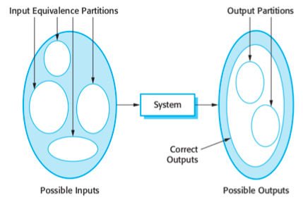

<!-- .slide:  data-background-opacity="0.1" data-background-image="https://media.itpro.co.uk/image/upload/v1570816546/itpro/2019/02/software_shutterstock_1290773869.jpg" 
data-transition="convex"  -->
# Teste de software 🖥️
<!-- .element: style="margin-bottom:100px; font-size: 50px; color:white; font-family: Marker Felt;" -->

Pressione 'F' para tela cheia
<!-- .element: style="font-size: small; color:white;" -->

[versão em pdf](?print-pdf)
<!-- .element: style="font-size: small;" -->

<!-- .slide: data-background="#2B2625" data-transition="zoom" -->
## Introdução 🐛
<!-- .element: style="margin-bottom:50px; font-size: 40px; font-family: Marker Felt; color:#F5F5F5" -->

<!-- .slide: data-background="#0E6655" data-transition="convex"  -->
## Introdução
<!-- .element: style="margin-bottom:50px; font-size: 40px; font-family: Marker Felt; color:#F5F5F5" -->

* Testes são desenvolvidos para mostrar que um programa faz o que ele realmente deveria fazer
<!-- .element: style="margin-bottom:50px; font-size: 23px; font-family: arial; color:#F5F5F5" -->

* Para realizar um teste, é necessário executar um programa com dados artificiais
<!-- .element: style="margin-bottom:50px; font-size: 23px; font-family: arial; color:#F5F5F5" -->

* Depois de executar um teste, é necessário analisar os resultados para verificar se existem erros, anomalias, etc.
<!-- .element: style="margin-bottom:50px; font-size: 23px; font-family: arial; color:#F5F5F5" -->

* Existem dois tipos de testes: validação e defeitos
<!-- .element: style="margin-bottom:50px; font-size: 23px; font-family: arial; color:#F5F5F5" -->

<!-- .slide: data-background="#0E6655" data-transition="convex"  -->
## Introdução
<!-- .element: style="margin-bottom:50px; font-size: 40px; font-family: Marker Felt; color:#F5F5F5" -->

 
<!-- .element height="50%" width="50%" -->

<!-- .slide: data-background="#0E6655" data-transition="convex"  -->
## Introdução 
<!-- .element: style="margin-bottom:50px; font-size: 40px; font-family: Marker Felt; color:#F5F5F5" -->

* O desenvolvimento de testes incluem todas as fases do desenvolvimento de um software
<!-- .element: style="margin-bottom:50px; font-size: 23px; font-family: arial; color:#F5F5F5" -->

* O testador de um software é geralmente o programador que escreveu o código
<!-- .element: style="margin-bottom:50px; font-size: 23px; font-family: arial; color:#F5F5F5" -->

* Em alguns processos de desenvolvimento, o testador e o programador trabalham em pares, onde cada programador possui um testador para auxiliar no processo de teste
<!-- .element: style="margin-bottom:50px; font-size: 23px; font-family: arial; color:#F5F5F5" -->

* Entretanto, em sistemas críticos, são utilizados grupos separados de programadores e testadores
<!-- .element: style="margin-bottom:50px; font-size: 23px; font-family: arial; color:#F5F5F5" -->

<!-- .slide: data-background="#0E6655" data-transition="convex"  -->
## Introdução
<!-- .element: style="margin-bottom:50px; font-size: 40px; font-family: Marker Felt; color:#F5F5F5" -->

* Durante o desenvolvimento, os testes podem ser executados testes em três níveis de granularidade, são eles:
<!-- .element: style="margin-bottom:50px; font-size: 23px; font-family: arial; color:#F5F5F5" -->
  
* **Teste unitários** – onde unidades de programas ou classes são testadas. Assim, este tipo de teste enfatiza objetos e seus métodos
<!-- .element: style="margin-bottom:50px; font-size: 23px; font-family: arial; color:#F5F5F5" -->

* **Teste de componente** – onde algumas unidades são integradas para criar componentes. Teste de componentes dão foco ao funcionamento de interfaces
<!-- .element: style="margin-bottom:50px; font-size: 23px; font-family: arial; color:#F5F5F5" -->

* **Teste de sistema** – quando todos os componentes de um sistema são integrados e o sistema é testado como um todo. O teste de sistema tem foco na interação entre componentes
<!-- .element: style="margin-bottom:50px; font-size: 23px; font-family: arial; color:#F5F5F5" -->

<!-- .slide: data-background="#2B2625" data-transition="zoom" -->
## Teste Unitário 🔍
<!-- .element: style="margin-bottom:50px; font-size: 40px; font-family: Marker Felt; color:#F5F5F5" -->

<!-- .slide: data-background="#0E6655" data-transition="convex"  -->
## Teste Unitário
<!-- .element: style="margin-bottom:50px; font-size: 40px; font-family: Marker Felt; color:#F5F5F5" -->

* Teste de uma unidade é o processo de testar trechos de código como métodos ou classes
<!-- .element: style="margin-bottom:50px; font-size: 23px; font-family: arial; color:#F5F5F5" -->

* Assim, o teste chama estas rotinas com diversos parâmetros de entrada com o objetivo de tentar identificar falhas
<!-- .element: style="margin-bottom:50px; font-size: 23px; font-family: arial; color:#F5F5F5" -->

* Se por exemplo, você realizar um teste num objeto, é necessário criar testes para analisar todas os serviços do objeto
<!-- .element: style="margin-bottom:50px; font-size: 23px; font-family: arial; color:#F5F5F5" -->

<!-- .slide: data-background="#0E6655" data-transition="convex"  -->
## Teste Unitário
<!-- .element: style="margin-bottom:50px; font-size: 40px; font-family: Marker Felt; color:#F5F5F5" -->

* Assim, em um objeto é importante testar:
<!-- .element: style="margin-bottom:50px; font-size: 23px; font-family: arial; color:#F5F5F5" -->

  * Todas as operações associadas com o objeto
<!-- .element: style="margin-bottom:50px; font-size: 23px; font-family: arial; color:#F5F5F5" -->
  
  * Atribuir e analisar todos os valores de atributos
<!-- .element: style="margin-bottom:50px; font-size: 23px; font-family: arial; color:#F5F5F5" -->
  
  * Colocar o objeto em diversos estados com o objetivo de simular todos os eventos que façam com que o objeto troque de estado
<!-- .element: style="margin-bottom:50px; font-size: 23px; font-family: arial; color:#F5F5F5" -->

<!-- .slide: data-background="#0E6655" data-transition="convex"  -->
## Teste Unitário
<!-- .element: style="margin-bottom:50px; font-size: 40px; font-family: Marker Felt; color:#F5F5F5" -->

* Imagine uma classe que implemente uma estação meteorológica
<!-- .element: style="margin-bottom:50px; font-size: 23px; font-family: arial; color:#F5F5F5" -->

* Para testar o estado de um objeto é necessário definir um modelo de estados
<!-- .element: style="margin-bottom:50px; font-size: 23px; font-family: arial; color:#F5F5F5" -->

* Usando um modelo, você conseguirá identificar sequências de estados que deverão ser testadas
<!-- .element: style="margin-bottom:50px; font-size: 23px; font-family: arial; color:#F5F5F5" -->

* Exemplos de estados para uma estação:
<!-- .element: style="margin-bottom:50px; font-size: 23px; font-family: arial; color:#F5F5F5" -->
  * Shutdown → Running → Shutdown
<!-- .element: style="margin-bottom:50px; font-size: 23px; font-family: arial; color:#F5F5F5" -->

  * Shutdown → Running → Collecting → Transmitting → Running→Shutdown
<!-- .element: style="margin-bottom:50px; font-size: 23px; font-family: arial; color:#F5F5F5" -->

<!-- .slide: data-background="#0E6655" data-transition="convex"  -->
## Teste Unitário
<!-- .element: style="margin-bottom:50px; font-size: 40px; font-family: Marker Felt; color:#F5F5F5" -->

* As vezes um objeto a ser testado possui algum tipo de dependência, como por exemplo, um banco de dados
<!-- .element: style="margin-bottom:50px; font-size: 23px; font-family: arial; color:#F5F5F5" -->

* Neste caso, você pode escolher utilizar objetos Mock
<!-- .element: style="margin-bottom:50px; font-size: 23px; font-family: arial; color:#F5F5F5" -->

* Mock, é um objeto com a mesma interface de um objeto real, porém, utilizado para simular funcionalidades
<!-- .element: style="margin-bottom:50px; font-size: 23px; font-family: arial; color:#F5F5F5" -->

* Assim, um objeto Mock de um banco de dados deve possuir itens organizados no formato de um array
<!-- .element: style="margin-bottom:50px; font-size: 23px; font-family: arial; color:#F5F5F5" -->

<!-- .slide: data-background="#0E6655" data-transition="convex"  -->
## Teste Unitário
<!-- .element: style="margin-bottom:50px; font-size: 40px; font-family: Marker Felt; color:#F5F5F5" -->

* Teste geralmente é algo caro e que gasta tempo de trabalho
<!-- .element: style="margin-bottom:50px; font-size: 23px; font-family: arial; color:#F5F5F5" -->

* Assim, é importante criar casos de teste efetivos:
<!-- .element: style="margin-bottom:50px; font-size: 23px; font-family: arial; color:#F5F5F5" -->
  
  * Casos de teste devem mostrar que o trecho de código faz o que ele deveria fazer
<!-- .element: style="margin-bottom:50px; font-size: 23px; font-family: arial; color:#F5F5F5" -->
  
  * Se existem defeitos, o teste deve revelar estes problemas
<!-- .element: style="margin-bottom:50px; font-size: 23px; font-family: arial; color:#F5F5F5" -->
  
  * Assim, normalmente escrevemos casos de testes para analisar o funcionamento normal de um sistema e, baseado na experiência de programação, criar testes para revelar problemas (usando entradas anormais)
<!-- .element: style="margin-bottom:50px; font-size: 23px; font-family: arial; color:#F5F5F5" -->

<!-- .slide: data-background="#0E6655" data-transition="convex"  -->
## Teste Unitário
<!-- .element: style="margin-bottom:50px; font-size: 40px; font-family: Marker Felt; color:#F5F5F5" -->

* Existem duas estratégias para ajudar a escolher casos de teste:
<!-- .element: style="margin-bottom:50px; font-size: 23px; font-family: arial; color:#F5F5F5" -->

  * **Teste de partição** – onde identificamos grupos de inputs com características comuns e que devem serem processadas da mesma maneira. Devem ser criados casos de teste para cada tipo de entrada de dado
  <!-- .element: style="margin-bottom:50px; font-size: 23px; font-family: arial; color:#F5F5F5" -->

  * **Teste baseado em orientação** – onde se utiliza uma orientação ou guia (_guideline_). Esta orientação reflete uma experiência passada sobre os tipos de erros que os programadores geralmente cometem
  <!-- .element: style="margin-bottom:50px; font-size: 23px; font-family: arial; color:#F5F5F5" -->

<!-- .slide: data-background="#0E6655" data-transition="convex"  -->
## Teste Unitário
<!-- .element: style="margin-bottom:50px; font-size: 40px; font-family: Marker Felt; color:#F5F5F5" -->

* A entrada e saída de um programa frequentemente caem num número de classes de características similares
<!-- .element: style="margin-bottom:50px; font-size: 23px; font-family: arial; color:#F5F5F5" -->

* Exemplo de classes: número, números negativos, strings, etc.
<!-- .element: style="margin-bottom:50px; font-size: 23px; font-family: arial; color:#F5F5F5" -->

* Os programas, geralmente se comportam da mesma maneira se a entrada de dado for da mesma classe
<!-- .element: style="margin-bottom:50px; font-size: 23px; font-family: arial; color:#F5F5F5" -->

* Por exemplo, se um método espera dois números positivos, então, o código deve se comportar na mesma maneira para qualquer número positivo
<!-- .element: style="margin-bottom:50px; font-size: 23px; font-family: arial; color:#F5F5F5" -->

<!-- .slide: data-background="#0E6655" data-transition="convex"  -->
## Teste Unitário
<!-- .element: style="margin-bottom:50px; font-size: 40px; font-family: Marker Felt; color:#F5F5F5" -->

 
<!-- .element height="50%" width="50%" -->

<!-- .slide: data-background="#0E6655" data-transition="convex"  -->
## Teste Unitário
<!-- .element: style="margin-bottom:50px; font-size: 40px; font-family: Marker Felt; color:#F5F5F5" -->

* As classes também são chamadas de partições ou domínios
<!-- .element: style="margin-bottom:50px; font-size: 23px; font-family: arial; color:#F5F5F5" -->

* Uma boa ideia é escolher testes que exercitem o limite de uma partição e também valores intermediários
<!-- .element: style="margin-bottom:50px; font-size: 23px; font-family: arial; color:#F5F5F5" -->

* Por exemplo, se você identificar uma partição de números positivos, então, o valor zero pode ser um ponto no limite
<!-- .element: style="margin-bottom:50px; font-size: 23px; font-family: arial; color:#F5F5F5" -->

<!-- .slide: data-background="#0E6655" data-transition="convex"  -->
## Teste Unitário
<!-- .element: style="margin-bottom:50px; font-size: 40px; font-family: Marker Felt; color:#F5F5F5" -->

 
<!-- .element height="50%" width="50%" -->

<!-- .slide: data-background="#0E6655" data-transition="convex"  -->
## Teste Unitário
<!-- .element: style="margin-bottom:50px; font-size: 40px; font-family: Marker Felt; color:#F5F5F5" -->

* Você identificará as partições através da especificação do sistema, da documentação de usuário ou da sua experiência anterior
<!-- .element: style="margin-bottom:50px; font-size: 23px; font-family: arial; color:#F5F5F5" -->

* Quando você utiliza, por exemplo, a especificação para criar as partições, então dizemos que isto é um "_**black-box testing**_"
<!-- .element: style="margin-bottom:50px; font-size: 23px; font-family: arial; color:#F5F5F5" -->

* Entretanto, pode ser útil olhar o código para identificar partições (ex.: olhar as exceções), neste caso, dizemos que este é um "_**white-box testing**_"
<!-- .element: style="margin-bottom:50px; font-size: 23px; font-family: arial; color:#F5F5F5" -->

<!-- .slide: data-background="#0E6655" data-transition="convex"  -->
## Teste Unitário
<!-- .element: style="margin-bottom:50px; font-size: 40px; font-family: Marker Felt; color:#F5F5F5" -->

* Você também pode utilizar guias para ajudar a escolher os casos de teste. Os guias possuem conhecimento de quais testes são realmente efetivos
<!-- .element: style="margin-bottom:50px; font-size: 23px; font-family: arial; color:#F5F5F5" -->

* Por exemplo, se você estiver testando um método que contém uma lista (_array_)
<!-- .element: style="margin-bottom:50px; font-size: 23px; font-family: arial; color:#F5F5F5" -->
  
  * Teste sequências com um único valor
<!-- .element: style="margin-bottom:50px; font-size: 23px; font-family: arial; color:#F5F5F5" -->
  
  * Use diferentes sequências de diferentes tamanhos em testes diferentes
<!-- .element: style="margin-bottom:50px; font-size: 23px; font-family: arial; color:#F5F5F5" -->
  
  * Derive testes de modo que exercite os primeiros elementos, meio e fim da sequência. Esta abordagem revela problemas de limites na partição
<!-- .element: style="margin-bottom:50px; font-size: 23px; font-family: arial; color:#F5F5F5" -->

<!-- .slide: data-background="#0E6655" data-transition="convex"  -->
## Teste Unitário
<!-- .element: style="margin-bottom:50px; font-size: 40px; font-family: Marker Felt; color:#F5F5F5" -->

* Algumas ideias gerais para teste:
<!-- .element: style="margin-bottom:50px; font-size: 23px; font-family: arial; color:#F5F5F5" -->

  * Escolha entradas que forcem o sistema a gerar todas as mensagens de erro possíveis
<!-- .element: style="margin-bottom:50px; font-size: 23px; font-family: arial; color:#F5F5F5" -->

  * Verifique entradas que causem buffers overflow
<!-- .element: style="margin-bottom:50px; font-size: 23px; font-family: arial; color:#F5F5F5" -->
  
  * Repita a mesma entrada ou série inúmeras vezes
<!-- .element: style="margin-bottom:50px; font-size: 23px; font-family: arial; color:#F5F5F5" -->
  
  * Force saídas inválidas
<!-- .element: style="margin-bottom:50px; font-size: 23px; font-family: arial; color:#F5F5F5" -->
  
  * Force resultados de computação muito grandes ou muito pequenos
<!-- .element: style="margin-bottom:50px; font-size: 23px; font-family: arial; color:#F5F5F5" -->

<!-- .slide: data-background="#0E6655" data-transition="convex"  -->
## Referências 📚
<!-- .element: style="margin-bottom:50px; font-size: 40px; font-family: Marker Felt; color:#F5F5F5" -->

* SOMMERVILLE, Ian. [Engenharia de software](https://biblioteca.ifrs.edu.br/pergamum_ifrs/biblioteca_s/acesso_login.php?cod_acervo_acessibilidade=5030950&acesso=aHR0cHM6Ly9taWRkbGV3YXJlLWJ2LmFtNC5jb20uYnIvU1NPL2lmcnMvOTc4ODU0MzAyNDk3NA==&label=acesso%20restrito), 10ª ed. Editora Pearson 768 ISBN 9788543024974.
<!-- .element: style="margin-bottom:50px; font-size: 23px; font-family: arial; color:#F5F5F5" -->

 
<a rel="license" href="http://creativecommons.org/licenses/by/4.0/">Creative Commons Atribuição 4.0 Internacional</a>

  <!-- .element: style="margin-top:150px; font-size: 15px; font-family: Bradley Hand" -->